# care-giver

Care coordination app for people with complex medical needs. Multi-tenant, real-time, invite-only.

**Stack:** Expo (React Native + TypeScript) · Supabase · React Query

---

## Contents

- [Overview](#overview)
- [Web app](#web-app)
- [How this was built](#how-this-was-built)
- [Prerequisites](#prerequisites)
- [Local development](#local-development)
- [Project structure](#project-structure)
- [Useful commands](#useful-commands)
- [Supabase Studio](#supabase-studio)

---

## Overview

care-giver helps a team of carers (family members, professional carers, nurses) stay coordinated around the daily care of someone with complex medical needs: medications, tube feeding/nutrition, therapy activities, and more. Each care recipient has their own private team; carers are invited in and see only the recipients they've been added to.

- **Today**: a live dashboard of the day's care tasks. Overdue items are surfaced first so nothing gets missed, with one-tap actions to record, skip, or mark items done.
- **Schedule**: the recurring plan behind Today, medications (compulsory or supplemental), nutrition/feeding, and activities, each with timing, instructions, and a "mark missed after" window.
- **Log**: a searchable, filterable history of everything that was recorded or missed, by day and by category.
- **Admin**: invite carers, assign roles (Admin, Senior Carer, Carer), revoke access, and manage as-needed medications.
- **Multi-patient support**: carers looking after more than one person (or belonging to more than one care team) can switch between them, or start a brand-new team from scratch.

<table>
<tr>
<td align="center" width="50%">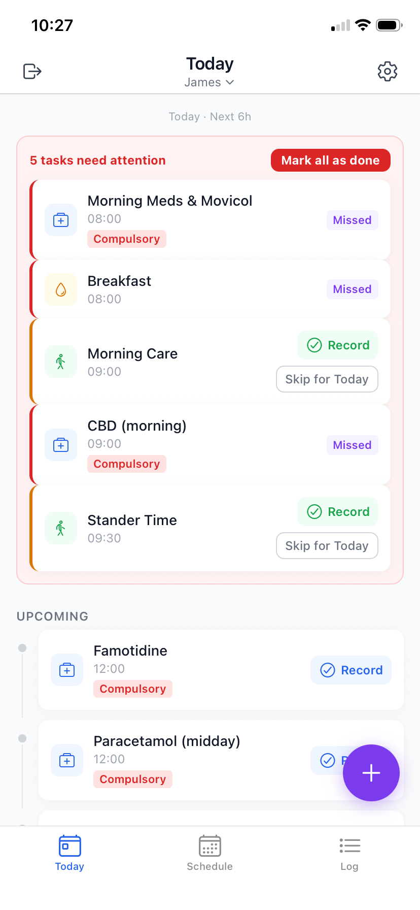<br/><sub><b>Today</b><br/>Daily tasks, with overdue items flagged</sub></td>
<td align="center" width="50%">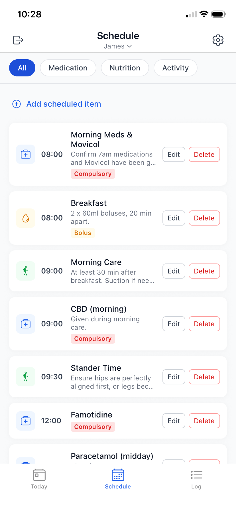<br/><sub><b>Schedule</b><br/>Recurring medication, nutrition & activity plan</sub></td>
</tr>
<tr>
<td align="center">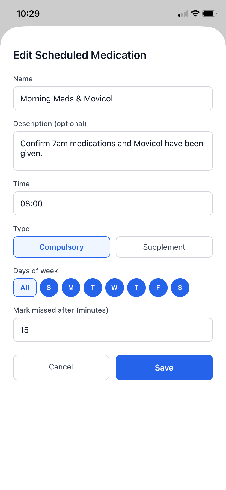<br/><sub><b>Edit Scheduled Medication</b><br/>Compulsory vs. supplement, days of week</sub></td>
<td align="center">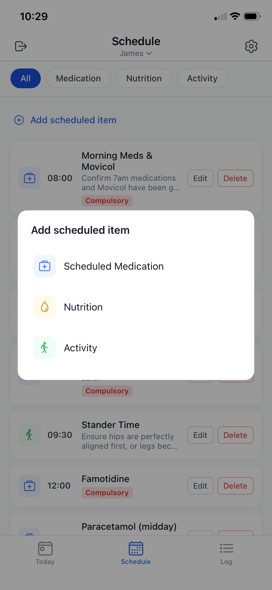<br/><sub><b>Add scheduled item</b><br/>Add a medication, nutrition, or activity</sub></td>
</tr>
<tr>
<td align="center">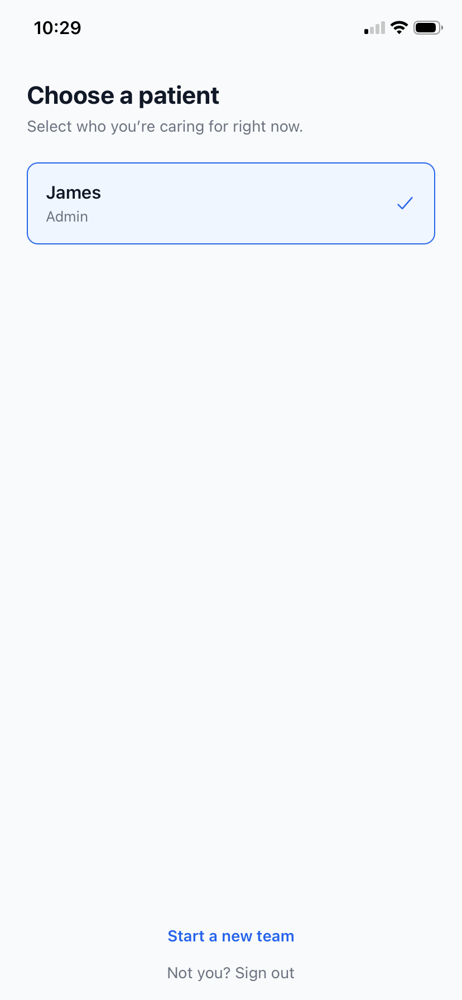<br/><sub><b>Choose a patient</b><br/>Switch between care recipients / teams</sub></td>
<td align="center">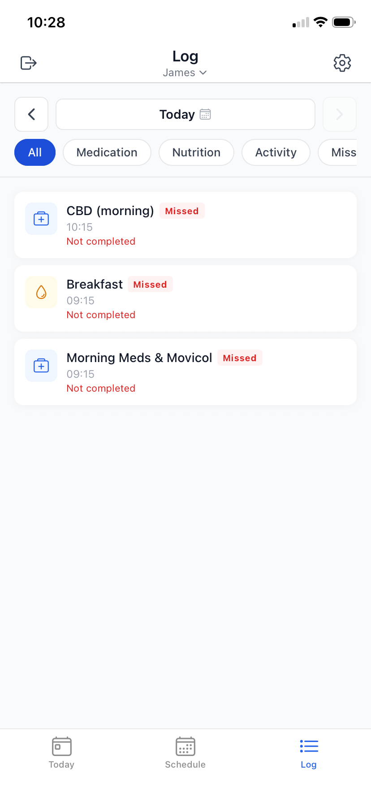<br/><sub><b>Log</b><br/>History of completed and missed care</sub></td>
</tr>
<tr>
<td align="center">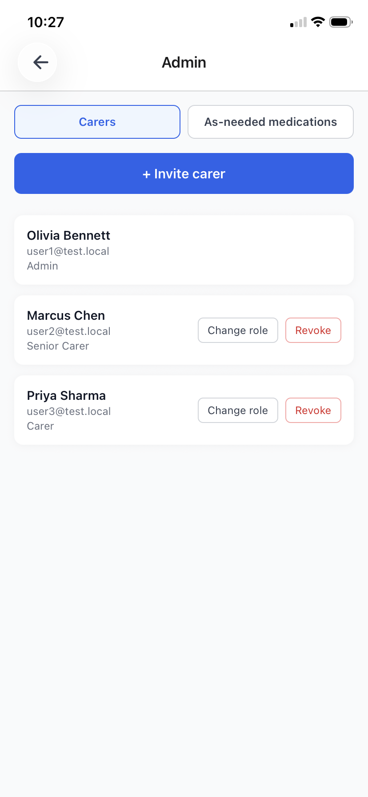<br/><sub><b>Admin</b><br/>Invite carers, manage roles & access</sub></td>
<td align="center">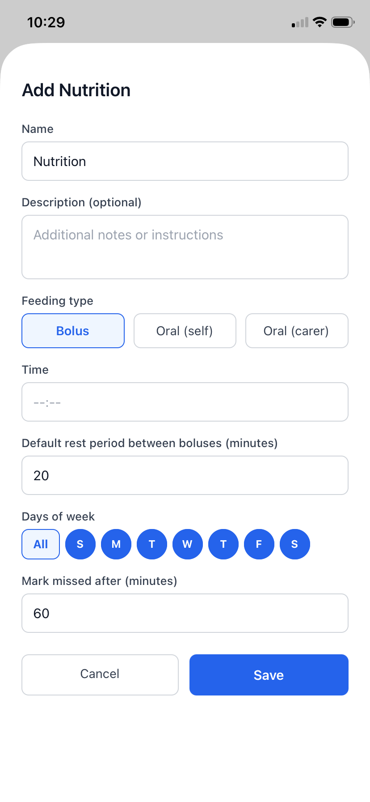<br/><sub><b>Add Nutrition</b><br/>Feeding type, bolus timing & rest period</sub></td>
</tr>
</table>

---

## Web app

The same care team also has a web dashboard (in `web/`) for schedule and team management from a desktop browser.

<table>
<tr>
<td align="center" width="100%">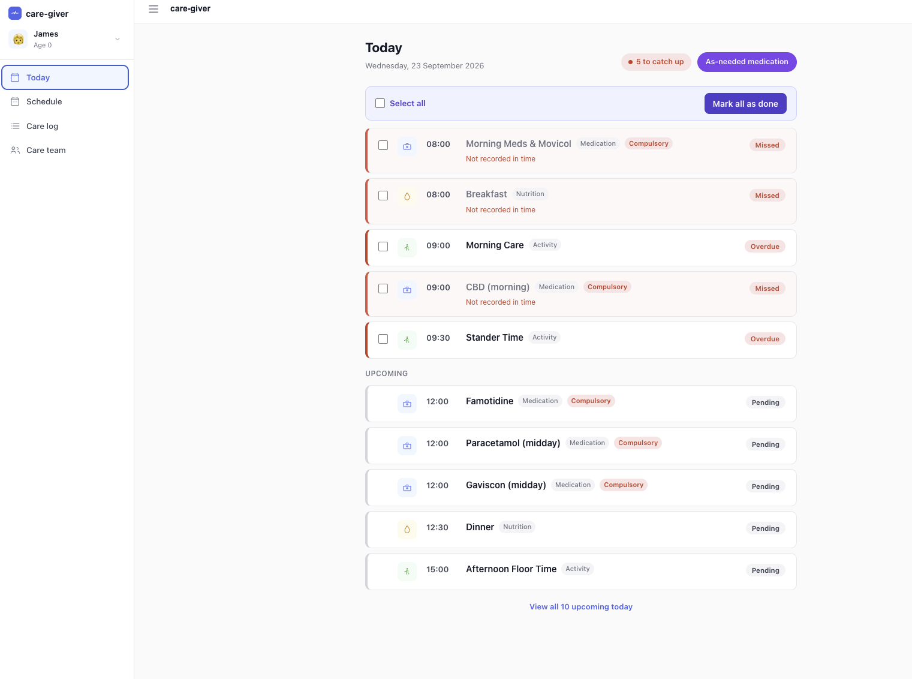<br/><sub><b>Today</b><br/>Daily tasks, overdue and upcoming</sub></td>
</tr>
<tr>
<td align="center">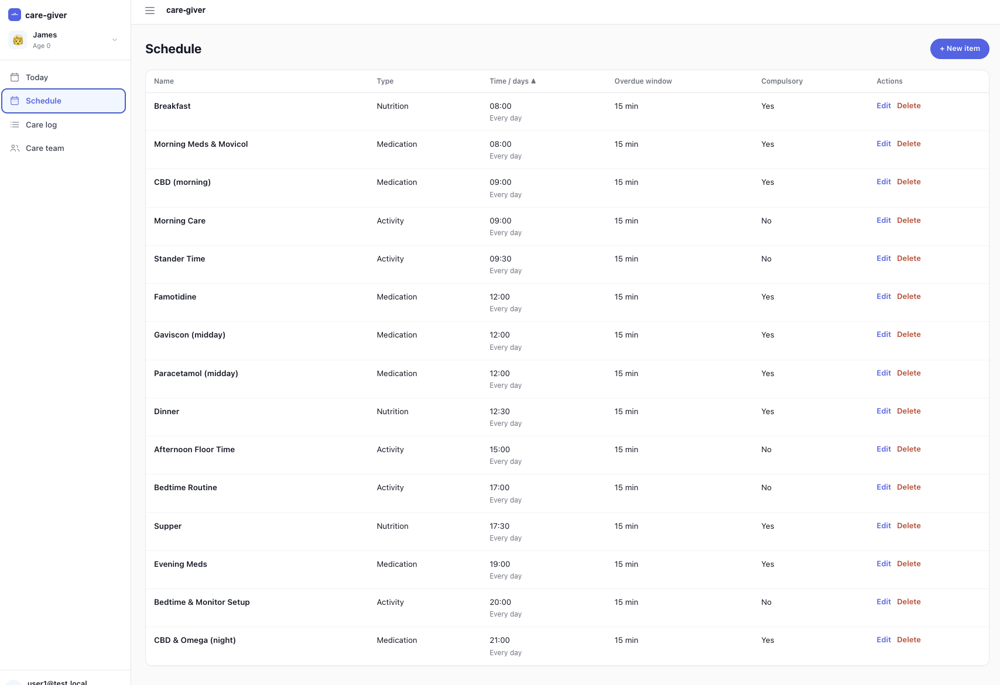<br/><sub><b>Schedule</b><br/>Full weekly plan in table form</sub></td>
</tr>
<tr>
<td align="center">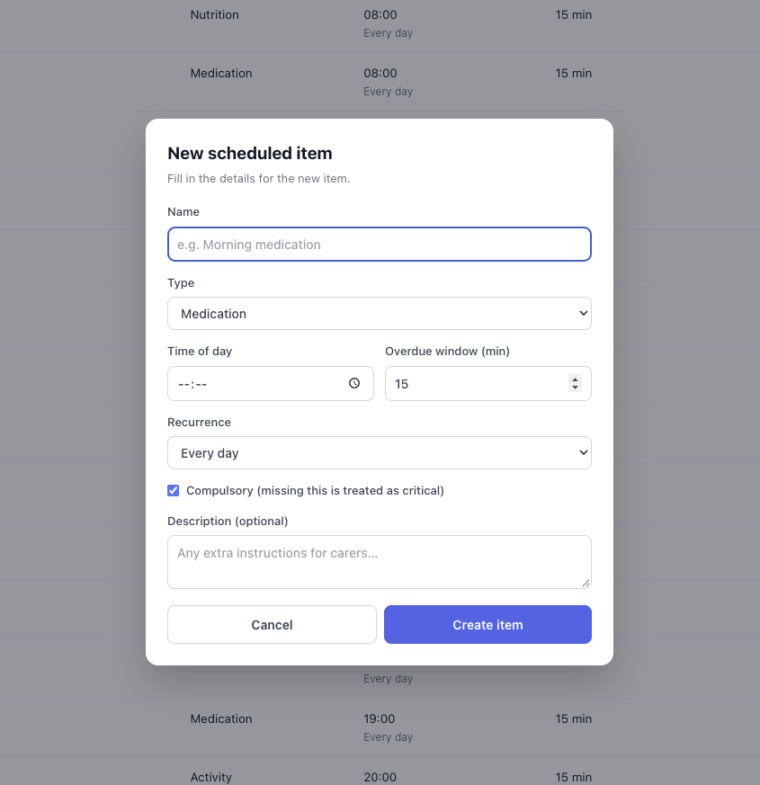<br/><sub><b>New scheduled item</b><br/>Add a medication, nutrition, or activity entry</sub></td>
</tr>
<tr>
<td align="center">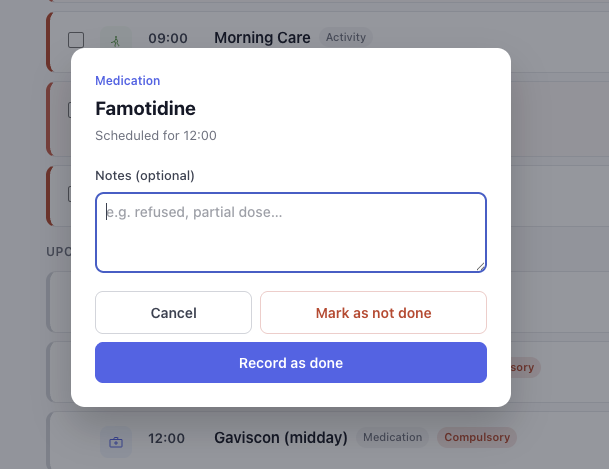<br/><sub><b>Record medication</b><br/>Mark a dose done or not done, with notes</sub></td>
</tr>
<tr>
<td align="center">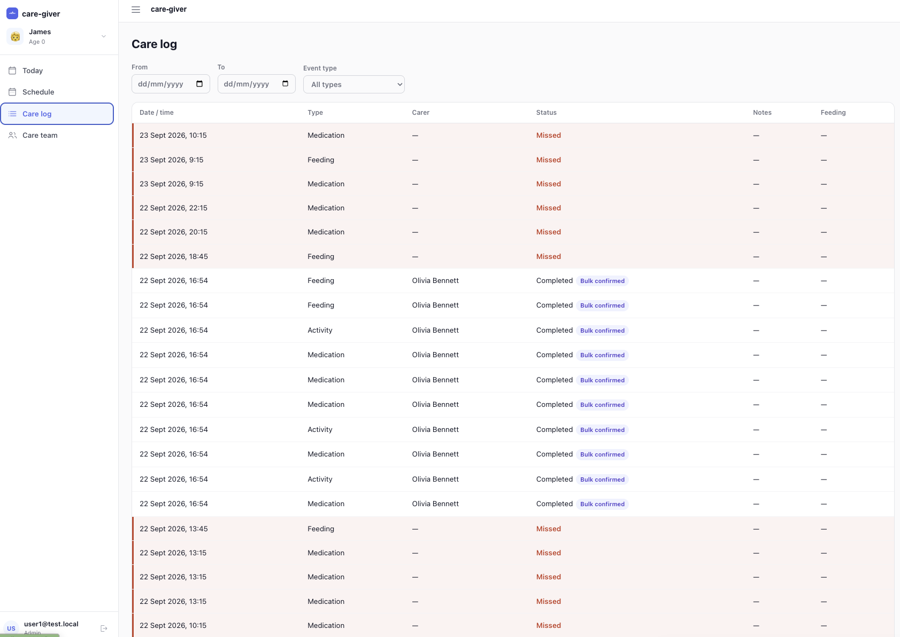<br/><sub><b>Care log</b><br/>Full history, filterable by date and event type</sub></td>
</tr>
<tr>
<td align="center">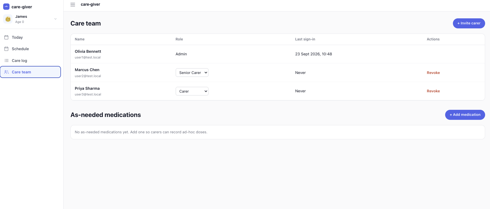<br/><sub><b>Care team</b><br/>Manage carer roles and as-needed medications</sub></td>
</tr>
</table>

---

## How this was built

This app is a side project in figuring out how far you can get building real software with [Claude Code](https://claude.com/claude-code) doing most of the typing, with me steering. It's been built over about 5 months, across over 200 commits and over 50 GitHub issues.

- Design docs first: [`PRD.md`](./PRD.md), [`CONTEXT.md`](./CONTEXT.md) for terminology, and a plain HTML wireframe ([`docs/care-giver-prototype.html`](./docs/care-giver-prototype.html)) that every screen is built against.
- Real architectural calls get a short ADR in [`docs/adr/`](./docs/adr/), so the reasoning sticks around.
- One GitHub issue, one branch, one PR. Big issues get split up rather than tackled all at once.
- A custom `implement-issue` skill runs the same steps each time: branch, plan, implement, verify, open a PR.
- Ground rules (RLS, append-only logs, no offline mode, invite-only roles, definition of done) live in `CLAUDE.md` instead of being repeated every conversation.
- **Lots of small commits.** The history is a lot of small, focused commits rather than a handful of massive ones. Little steps were easier to get right and easier to back out of when something didn't work.

---

## Prerequisites

- [Node.js](https://nodejs.org) 20+
- [Docker Desktop](https://www.docker.com/products/docker-desktop/) (for local Supabase)
- [Expo Go](https://expo.dev/go) on your phone, or an iOS/Android simulator
- Expo CLI: `npm install -g expo-cli` (optional, `npx expo` works without it)

---

## Local development

### 1. Clone and install

```bash
git clone https://github.com/seanfitzg/care-giver.git
cd care-giver
npm install --legacy-peer-deps
```

### 2. Start local Supabase

Docker Desktop must be running first.

```bash
npm run supabase:start
```

On first run this pulls the Supabase Docker images (~1 GB). Once running it prints your local API URL and anon key:

```
API URL: http://127.0.0.1:54321
anon key: eyJ...
Studio: http://127.0.0.1:54323
```

### 3. Configure environment

```bash
cp .env.example .env
```

Edit `.env` and paste in the `anon key` printed above:

```
EXPO_PUBLIC_SUPABASE_URL=http://127.0.0.1:54321
EXPO_PUBLIC_SUPABASE_ANON_KEY=eyJ...
```

### 4. Run the app

```bash
npm start
```

- Press `i` for iOS simulator, `a` for Android emulator, `w` for web, or scan the QR code with Expo Go.

### Stop Supabase

```bash
npm run supabase:stop
```

---

## Project structure

```
app/
  _layout.tsx          # Root layout: QueryClientProvider + Auth + Duty providers
  (tabs)/
    _layout.tsx        # Bottom-tab navigator
    index.tsx          # Today screen
    feed.tsx           # Feeding session screen
    on-duty.tsx        # Duty management screen
    log.tsx            # Care history screen
contexts/
  AuthContext.tsx      # Auth state (session, user, signOut)
  DutyContext.tsx      # On-duty state (checkIn, checkOut)
lib/
  supabase.ts          # Supabase client
supabase/
  config.toml          # Local Supabase configuration
  migrations/          # Database migrations (added in issue #2)
  seed.sql             # Development seed data
```

---

## Useful commands

| Command                  | Description                              |
| ------------------------ | ---------------------------------------- |
| `npm start`              | Start the Expo dev server                |
| `npm run type-check`     | TypeScript type-check (no emit)          |
| `npm run lint`           | ESLint                                   |
| `npm run supabase:start` | Start local Supabase stack               |
| `npm run supabase:stop`  | Stop local Supabase stack                |
| `npx supabase db reset`  | Reset DB and re-run migrations + seed    |
| `npx supabase db diff`   | Diff schema changes into a new migration |

---

## Supabase Studio

When the local stack is running, the Studio is at [http://127.0.0.1:54323](http://127.0.0.1:54323). Use it to inspect tables, run queries, and manage auth users during development.
